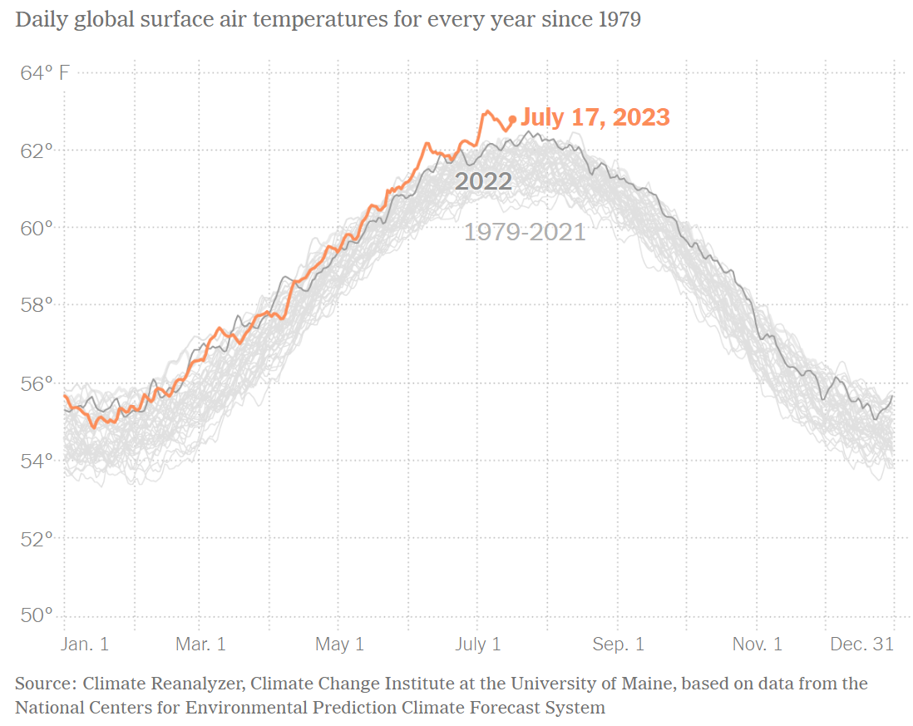

This graph tells us what the global daily temperature has been since 1979. It highlights last year and this year's data.

To recreate this visualization, I'm going to need some daily weather data over a long period of time.

Since I cannot find the original data, I'm going to use the twin cities data from [here](https://www.dnr.state.mn.us/climate/historical/daily-data.html?sid=mspthr&sname=Minneapolis/St%20Paul%20Threaded%20Record&sdate=2010-01-01&edate=por).
I'm also going to highlight the current year but I'm going to leave each year with it's own color so it might be easier to notice which year was hottest during a certain period.

```{r, include=FALSE}
# Load necessary libraries
library(ggplot2)
library(dplyr)
library(lubridate) # for date manipulation

# Read the CSV file
data <- read.csv('DataDowloadCSV.csv')

# Convert Date to Date type and extract Year
data$Date <- as.Date(data$Date, format = "%Y-%m-%d")
data$Year <- as.integer(format(data$Date, "%Y"))

# Calculate daily average temperature using the new column names
data$Average_Temperature <- (data$MaxTemp + data$MinTemp) / 2

# Extract Month-Day for plotting
data$MonthDay <- format(data$Date, "%m-%d")

# Assign alpha values based on the year
data$Alpha <- ifelse(data$Year < 2023, 0.9, 1) # 0.5 for 2010-2022, 1 for 2023

# Create the line graph using ggplot2
plot <- ggplot(data, aes(x = MonthDay, y = Average_Temperature, group = Year, color = as.factor(Year), alpha = Alpha)) +
    geom_line() +
    labs(title = "Daily Average Temperature by Year",
         x = "Month",
         y = "Average Temperature (F)",
         color = "Year") +
    theme_minimal() +
    theme(axis.text.x = element_text(angle = 45, hjust = 1)) +
    guides(alpha = "none") + # Hide the alpha guide
    scale_x_discrete(breaks = format(seq(from = as.Date("2000-01-01"), to = as.Date("2000-12-01"), by = "month"), "%m-%d"), labels = month.abb) # Custom x-axis breaks and labels
```

```{r echo=FALSE}
print(plot)
```
