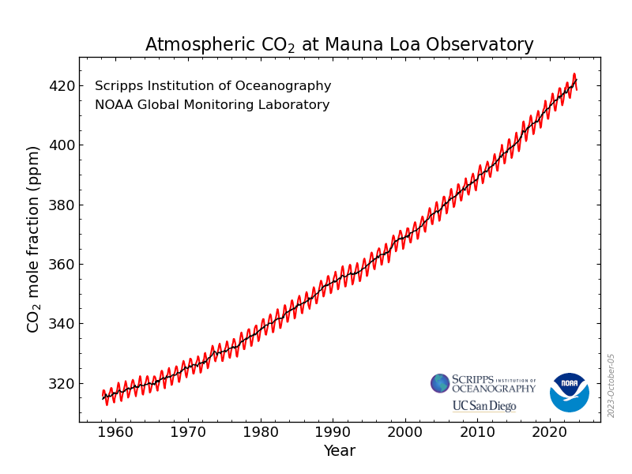

# Week 9 Visualisation Reconstruction Xander



[link to image - https://gml.noaa.gov/webdata/ccgg/trends/co2_data_mlo.png](https://gml.noaa.gov/webdata/ccgg/trends/co2_data_mlo.png)

[link to findings - https://gml.noaa.gov/ccgg/trends/mlo.html](https://gml.noaa.gov/ccgg/trends/mlo.html)

This visualization displays the average CO~2~ content in parts per million observed at the Mauna Loa Observatory in Hawaii over nearly the past 80 years.

The X axis represents time in years. The Y axis represents the CO~2~ concentration.

The plot has a red line that displays the average CO~2~ concentration and a black line that displays the rolling average.

I personally don't like how the grid doesn't display all the way across the plot, so I'm going to intentionally leave the default lines there so you can see specifcally when certain numbers have been hit.

I also don't like how both the red and black lines are the same opacity, so I want to make the red line a bit more transparent to highlight the rolling average line.

I'm going to need the data set which includes the CO~2~ readings and their timestamps. I was able to find the monthly averages since 1958 on noaa's webiste.

```{r lib, message=FALSE}
# Load libraries
library(tidyverse) # for reading in the dataset
library(ggplot2) # for creating the graph
library(zoo) # for creaing the rolling mean
```

```{r load data, message=FALSE}
# Load the data
co2_data <- read_csv("co2_mm_mlo.csv")
```

```{r plot, message=FALSE, warning=FALSE}
# Create the rolling average for the center line
co2_data$RollingMean <- rollmean(co2_data$average, k = 12, fill = NA, align = "center")

# Plot the data
plot <- ggplot(data = co2_data, aes(x = `decimal date`, y = average)) +
  geom_line(color = "red", size = 1.5, alpha = 0.5) +
  geom_line(aes(y = RollingMean), color = "black", size = 1.5) +
  labs(
    title = "Atmospheric CO2 at Mauna Loa Observatory",
    x = "Year",
    y = "CO2 mole fraction (ppm)"
  )
```

```{r print plot, echo=FALSE, warning=FALSE}
print(plot)
```
